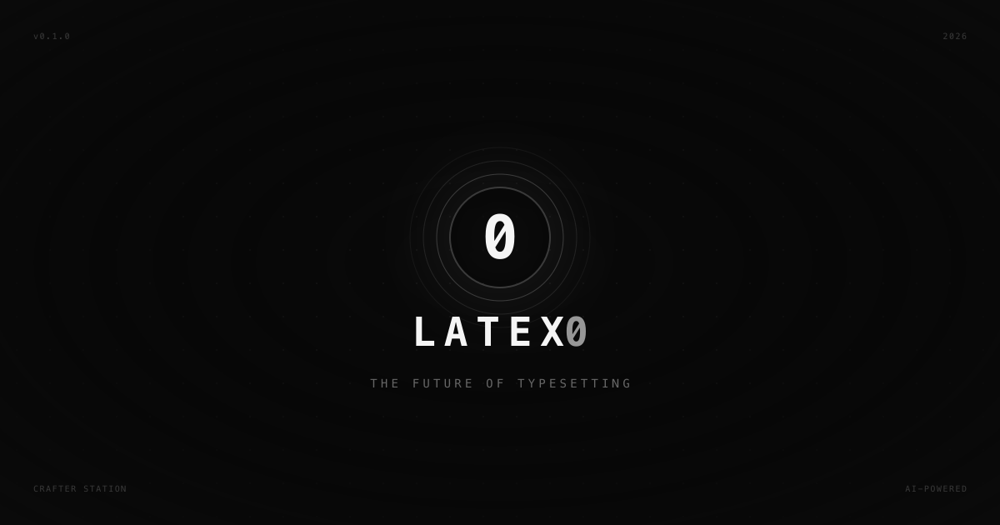

<p align="center">
  
</p>

<h1 align="center">
  LATEX0
</h1>

<p align="center">
  The Future of Typesetting
  <br />
  <br />
  <a href="https://latex0.crafter.run">Website</a>
  ·
  <a href="https://github.com/crafter-station/latex0/issues">Issues</a>
</p>

<p align="center">
  <a href="https://nextjs.org">
    
  </a>
  <a href="https://supabase.com">
    
  </a>
  <a href="https://www.typescriptlang.org">
    
  </a>
  <a href="https://monaco-editor.github.io">
    
  </a>
</p>

<p align="center">
  <sub>
    Built by
    <a href="https://www.crafterstation.com">
      Crafter Station
    </a>
  </sub>
</p>

## About

LATEX0 is an AI-powered LaTeX editor for the modern era. Write, compile, and collaborate in real-time.

**Researchers deserve open source tools.**

## Features

- **AI Assistant** — Chat with AI to generate and edit LaTeX code
- **Real-time Collaboration** — See other users' cursors live with unique colors
- **Monaco Editor** — VS Code-quality editing with LaTeX syntax highlighting
- **Live Preview** — Instant PDF rendering as you type

## Quick Start

```bash
# Clone
git clone https://github.com/crafter-station/latex0.git
cd latex0

# Install
bun install

# Configure
cp .env.example .env.local
# Add your Supabase keys

# Run
bun dev
```

Open [http://localhost:3000](http://localhost:3000)

## Environment Variables

```bash
NEXT_PUBLIC_SUPABASE_URL=your_supabase_url
NEXT_PUBLIC_SUPABASE_PUBLISHABLE_DEFAULT_KEY=your_supabase_key
NEXT_PUBLIC_CLERK_PUBLISHABLE_KEY=your_clerk_key
NEXT_PUBLIC_CLERK_SECRET_KEY=your_clerk_secret
```

## License

MIT

---

<p align="center">
  Built with care by <a href="https://www.crafterstation.com">Crafter Station</a>
</p>
